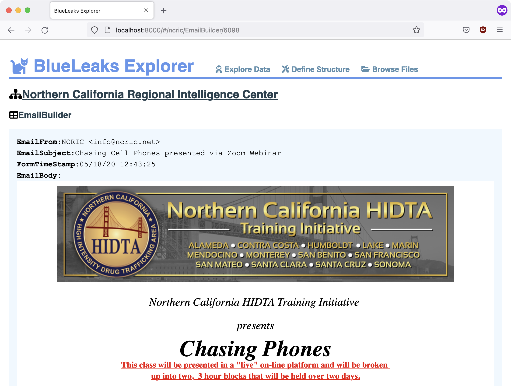

# BlueLeaks Explorer

BlueLeaks Explorer is open source software for journalists to investigate all of the data in the [BlueLeaks dataset](https://ddosecrets.com/wiki/BlueLeaks). You must have a copy of the BlueLeaks dataset (250GB to download, 271GB once extracted) in order to use it.

For in-depth instructions, read Chapter 10 of **Hacks, Leaks, and Revelations**.



## How it Works

The BlueLeaks dataset contains hundreds of folders with names like `ncric` (Northern California Regional Intelligence Center), `arictexas` (Austin Regional Intelligence Center), and `memiac` (Maine Information Analysis Center). Each of these folders includes data from a different hacked law enforcement website.

These websites use Microsoft Access databases, and the data from these databases is available in hundreds of CSV files with names like `EmailBuilder.csv` (all of the bulk emails sent by the website), `Registrations.csv` (details about everyone who has an account on the website), and `SARs.csv` ("suspicious activity reports").

BlueLeaks Explorer is a tool that lets you visualize and search the data in these CSV files. Each BlueLeaks site is different--it has a different structure, with different tables that are related to each other in different ways. Exactly how a BlueLeaks site should be laid out is called its _structure_, and you can use BlueLeaks Explorer to define it.

For example, for each table you choose which fields are interesting and should be displayed, and you can hide the rest. You can define the type of each field. If a field represents a path to a document in BlueLeaks, you can make it link directly to that document. If it's a path to an image in the BlueLeaks data, you can make it display the image. If it's includes HTML, you can render the HTML. You can also define relationships between tables--you can make it so when you view a row in `DocumentCategory`, it displays all of the `Document` rows in that categy. And when you view a `Docuument` it displays the actual `DocumentCategory` that it's associated with instead of just a `DocumentCategoryID`.

## Getting Started

To run BlueLeaks Explorer on your computer, you need [Docker](https://www.docker.com/products/docker-desktop/) installed.

### Create Your docker-compose.yaml

Create a new folder for your BlueLeaks Explorer data, which will take up about 5GB of data. Create a file in that folder called `docker-compose.yaml`, and copy and paste this into it:

```yaml
version: "3.9"
    
services:
  app:
    image: micahflee/blueleaks-explorer:latest
    ports:
      - "8000:80"
    volumes:
      - /Volumes/datasets/BlueLeaks-extracted:/data/blueleaks
      - ./databases:/data/databases
      - ./structures:/data/structures
```

Under `volumes`, replace `/Volumes/datasets/BlueLeaks-extracted` with the path to the extracted BlueLeaks dataset on your computer.

Open a terminal, change to your BlueLeaks Explorer folder, and run:

```sh
docker-compose up
```

Wait for the `blueleaks-explorer` container to start.

### Initialize BlueLeaks Explorer

The first time you use BlueLeaks Explorer you must run the initialize script. This will import data from all of the CSV files into SQLite databases.

Open a new terminal, change to your BlueLeaks Explorer folder, and run this command:

```sh
docker-compose exec app poetry run python ./initialize.py
```

It will take several minutes to run, and it will create 4.7GB of SQLite3 databases in your `databases` folder. You only need to do this step once.

### Using BlueLeaks Explorer

Load [http://localhost:8000/](http://localhost:8000/) in a web browser. Welcome to BlueLeaks Explorer!